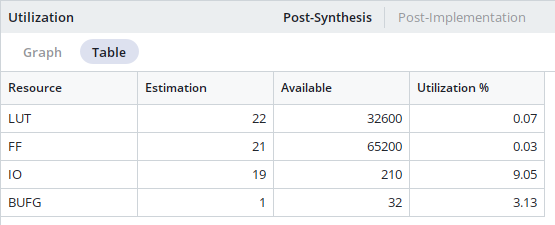

# **PROJEKT PWM BREATHING LED**

Cílem projektu je implementace digitálního systému pro plynulé řízení jasu všech 16 LED diod na desce Nexys A7-50T. Jas diod se periodicky mění (lineární nárůst a pokles), čímž simuluje efekt „dýchání".

Princip spočívá v rychlém přepínání LED pomocí pulzně-šířkové modulace (PWM). Střída signálu (duty) se plynule mění, přičemž frekvence blikání je vysoká tak, aby lidské oko vnímalo pouze změnu intenzity světla, nikoliv samotné blikání.

## **Členové týmu:**

- Robin Klapetek
- Pavel Korec

## **Schéma**

****

## **Základní parametry**

- **I/O Porty:**
  - **clk (in)** - Hlavní hodinový signál desky 100MHz
  - **rst (in)** - Asynchronní reset systému.
  - **en (in)** - Switch, povoluje propouštění PWM signálu na výstup
  - **pwm_out (out)** - 16bitová výstupní sběrnice připojená k 16 LED diodám. Všechny bity sběrnice jsou buzeny společným signálem sig_pwm_single (díky tomu LED synchronně svítí a „dýchají")
- **Vnitřní moduly a logika systému:**

- **clk_en_inst (generátor povolovacích pulzů)** - instance modulu clk_en sloužící jako dělička frekvence. Z hlavních 100 MHz generuje pomalé pulzy (clock enable). Frekvence těchto pulzů je dána parametrem G_MAX (určuje jak rychle bude probíhat efekt dýchání).
- **pwm_cnt_inst (rychlý čítač pro PWM)** - první instance modulu counter konfigurovaná jako 8bitový čítač. Tento blok vždy povolen (en => '1') a na plné rychlosti systémových hodin počíta od 0 do 255. Tím na svém výstupu tvoří rychlý digitální pilovitý signál - základ pro pulse width modulation (okem neviditelné blikání při frekvenci cca 390 kHz).
- **jas_cnt_inst (čítač jasu - generování dýchání)** - druhá instance modulu counter, 9 bitů. Tento čítač je taktován pulzy sig_ce, počítá velmi pomalu od 0 do 511. Jeho hodnota reprezentuje jas.

- **Logika nádechu a výdechu** - Směr změny jasu je určen nejvyšším 9. bitem (MSB). Pokud je MSB 0 (1. polovina periody), hodnota spodních 8 bitů se používá přímo a jas roste. Pokud je MSB 1 (2. polovina), spodních 8 bitů se neguje, čímž hodnota začne klesat - jas se snižuje. Výsledek se ukládá do sig_jas_upraveny

- **PWM komparátor** \- tvorba PWM signálu (sig_pwm_single). Porovnává se hodnota rychlého čítače a úrovně jasu. Pokud je hodnota rychlého čítače menší než hodnota upraveného jasu ( unsigned(sig_cnt_pwm) &lt; unsigned(sig_jas_upraveny) ) a zároveň máme zapnutý switch (en =&gt; '1'), je na výstup poslána logická '1'. Tím se automaticky mění šířka pulzu úměřně jasu.

## **Časování a ostatní parametry:**
**1. Systémové signály**:

**Hodiny (clk):** 100 MHz (perioda 10 ns)

**Reset (rst):** Active-Low - v top levelu invertován

**2. Parametry PWM modulace:**

**Rozlišení:** 8 bitů (256 úrovní třídy)

**Frekvence PWM:** cca 390,6 kHz (100MHz/256) - Zamezuje, aby blikání bylo viditelné.

**3. Parametry dýchání:**

**Řízení směru:** 9bitový čítač (0-511, 9. bit (MSB) určuje směr (0 - jas roste, 1 - jas klesá), spodních 8 bitů určuje střídu PWM.

**Rychlost krokování:** Dělička frekvence (G_MAX = 500 000) generuje povolovací pulz s frekvencí 200 Hz - jas se mění o 1 stupeň každých 5 ms.

**Délka cyklu:** Kompletní cyklus trvá 2,56 sekundy z toho 1,28 s - rozsvěcovaní a 1,28 s - zhasínání.

## **Simulace**

**** 

Na prvním snímku je zachycen detailní průběh na začátku simulace. Klíčový je zde vztah mezi systémovými hodinami s_clk (100 MHz) a povolovacím signálem sig_ce (Clock Enable). Je vidět, že sig_ce generuje krátké pulzy, které určují rychlost změny jasu. Výstup s_pwm_out zatím zůstává v nule, protože vnitřní čítač PWM ještě nepřekonal nastavenou hladinu jasu.

****

Zde je zobrazen princip PWM modulace v detailu. Horní sběrnice s_pwm_out[15:0] ukazuje stav všech 16 LED. Je vidět, že šířka logické jedničky (střída) se mění v závislosti na tom, jak vnitřní čítač PWM (sig_cnt_pwm) porovnává svou hodnotu s aktuálním registrem jasu. Čím je hodnota jasu vyšší, tím déle zůstává výstup v jedničce a lidskému oku se zdá, že LED svítí intenzivněji.

****

Tento snímek zachycuje delší časový úsek (jednotky milisekund), který ukazuje dynamiku „dýchání“. PWM pulzy jsou zde vidět jako husté bloky, které se plynule rozšiřují. Tento pohled potvrzuje, že modulace neprobíhá skokově, ale plynule, což je zásadní pro vizuální efekt lineárního nárůstu jasu na všech 16 výstupech současně.

****

Snímek ukazuje logiku přechodu mezi „nádechem“ a „výdechem“. Sledujeme zde 9bitový čítač jasu, kde jeho nejvyšší bit (MSB) slouží jako přepínač směru. V momentě, kdy MSB změní stav, začne se hodnota jasu díky použitému multiplexoru a invertoru v kódu snižovat. Tím je realizován trojúhelníkový průběh jasu bez nutnosti složitých výpočtů.

****

Poslední detail potvrzuje stabilitu výstupu. Všechny změny na výstupní sběrnici s_pwm_out jsou synchronizovány s náběžnou hranou hodin s_clk. Díky implementaci výstupního registru (D-FF) je eliminováno riziko vzniku hazardních stavů (glitchů), které by mohly nastat při souběhu změn v kombinační logice komparátoru a čítačů.

### **Odkaz na testbench**
**[Zobrazit testbench](PWM_Breathing_LED/pwm.srcs/sim_1/new/tb_pwm_top.vhd)**

## **Resource Report**

****
