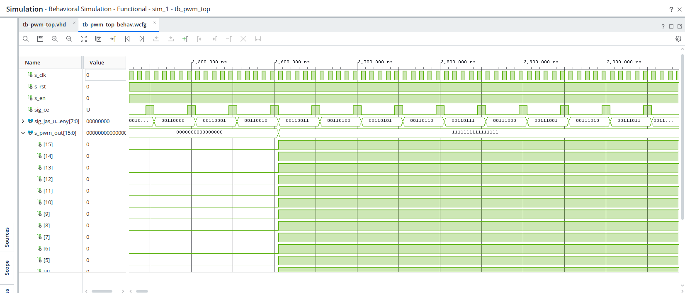
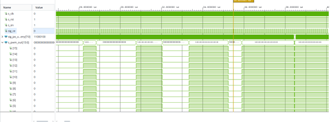
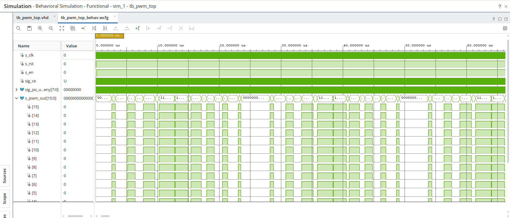
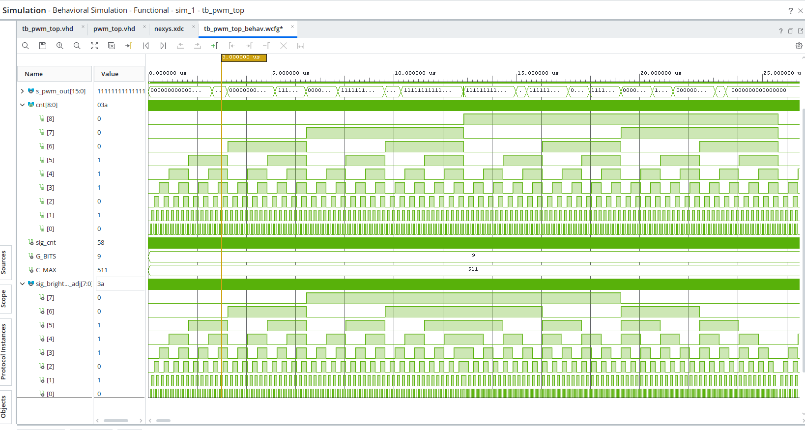
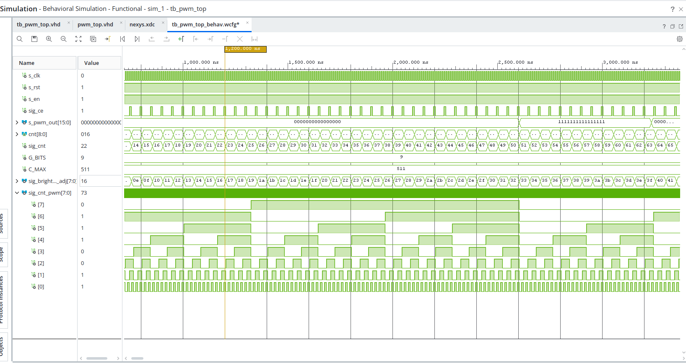
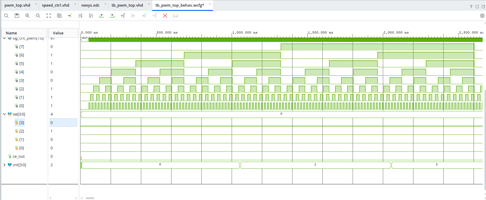
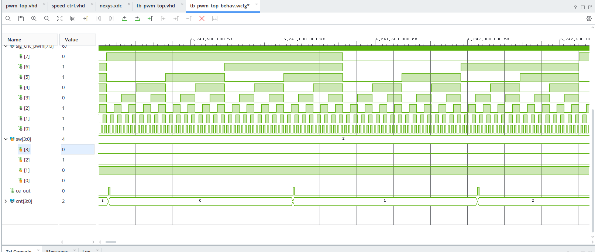
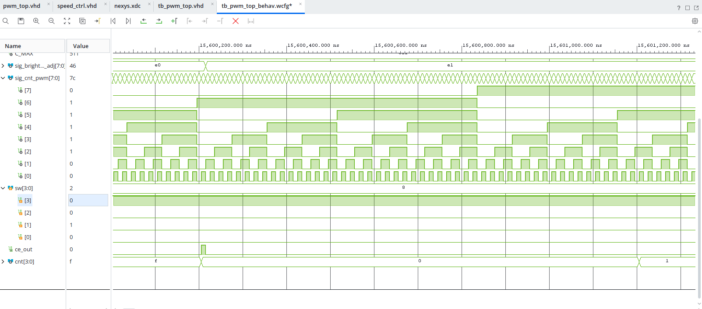

# **PROJEKT PWM BREATHING LED**

Cílem projektu je implementace digitálního systému pro plynulé řízení jasu všech 16 LED diod na desce Nexys A7-50T. Jas diod se periodicky mění (lineární nárůst a pokles), čímž simuluje efekt „dýchání".

Princip Pulzně-šířkové modulace (PWM): Základem řízení jasu u digitálních systémů je PWM. Protože digitální pin umí pouze logickou 0 (0 V) nebo logickou 1 (3.3 V), nemůžeme napětí měnit spojitě. Jas tedy simulujeme poměrem času, po který je dioda zapnutá ($T_{ON}$), k celkové periodě signálu ($T_{PERIOD}$). 

Střída (Duty Cycle): Definována jako $D = \frac{T_{ON}}{T_{PERIOD}} \cdot 100\,\%$. 

Frekvence: Musí být dostatečně vysoká, aby oko díky své setrvačnosti vyhladilo blikání do konstantního jasu. V našem projektu cílíme na řádově jednotky kHz.

## **Členové týmu:**

- Robin Klapetek
- Pavel Korec

## **Schéma**

****

## **Základní parametry**

## **Architektura: TOP Level (`pwm_top`)**

Modul `pwm_top` zastřešuje celou hierarchii projektu. Propojuje děličku frekvence, řadič rychlosti, čítače jasu a samotný PWM komparátor s výstupním registrem.

### **I/O Porty (Top Level)**

| Port | Směr | Typ | Šířka | Popis |
| :--- | :---: | :---: | :---: | :--- |
| **clk** | in | std_logic | 1 bit | Hlavní hodinový signál desky (100 MHz). |
| **rst** | in | std_logic | 1 bit | Reset systému (na desce Nexys A7 Active-Low). V top levelu invertován. |
| **en** | in | std_logic | 1 bit | Povolovací signál (Switch J15), aktivuje výstup PWM na LED. |
| **sw** | in | std_logic_vector | 4 bity | Přepínače pro volbu rychlosti dýchání. |
| **pwm_out** | out | std_logic_vector | 16 bitů | Výstupní sběrnice připojená k 16 LED diodám. |

### **Vnitřní moduly a komponenty**

| Modul / Komponenta | Parametry (Generics) | Funkce a detailní popis |
| :--- | :---: | :--- |
| **clk_en_inst** | `G_MAX = 100 000` | **Dělička frekvence.** Z hlavních 100 MHz generuje základní povolovací pulz `sig_ce` s frekvencí 1 kHz. |
| **speed_ctrl_inst** | — | **Modul řízení rychlosti.** Přijímá 1 kHz pulzy a dělí je na základě stavu `sw`. Výstupem je `sig_ce_brightness`. |
| **pwm_cnt_inst** | `G_BITS = 8` | **PWM čítač.** Rychlý čítač (100 MHz) určující frekvenci PWM (256 úrovní). |
| **brightness_cnt_inst** | `G_BITS = 9` | **Čítač jasu.** Inkrementuje se pouze při aktivním `sig_ce_brightness`. Definuje periodu dýchání. |
| **Inhale/Exhale Logic** | — | **Logika směru.** Využívá MSB čítače jasu pro přepínání mezi nárůstem a poklesem jasu. |
| **Output Register** | — | **D-FF registr.** Synchronizuje výstup na `clk` a eliminuje hazardní stavy (glitche). |

## **Architektura: Řízení rychlosti (`speed_ctrl`)**

Tento modul umožňuje uživateli měnit rychlost plynulé změny jasu pomocí přepínačů na desce.

### **I/O Porty (Speed Control)**

| Port | Směr | Typ | Šířka | Popis |
| :--- | :---: | :---: | :---: | :--- |
| **clk** | in | std_logic | 1 bit | Systémové hodiny. |
| **rst** | in | std_logic | 1 bit | Synchronní reset (Active-High). |
| **ce_in** | in | std_logic | 1 bit | Vstupní puls (1 kHz) z hlavní děličky. |
| **sw** | in | std_logic_vector | 4 bity | Vstupy z přepínačů pro volbu dělícího poměru. |
| **ce_out** | out | std_logic | 1 bit | Výstupní clock enable určující rychlost změny jasu. |

### **Logika přepínačů a rychlosti**

Modul využívá vnitřní 4bitový čítač `cnt` k dělení vstupní frekvence 1 kHz:

| Aktivní switch | Režim | Dělící poměr | Frekvence krokování jasu |
| :--- | :--- | :---: | :--- |
| **`sw(1)`** | **Nejrychlejší** | 1 | 1000 Hz |
| **`sw(0)`** | **Rychlejší** | 2 | 500 Hz |
| **`sw(2)`** | **Pomalejší** | 8 | 125 Hz |
| **`sw(3)`** | **Nejpomalejší** | 16 | 62,5 Hz |
| **Vše '0'** | **Výchozí** | 4 | 250 Hz |

*Priorita je dána pořadím v kódu: sw(1) > sw(0) > sw(2) > sw(3).*

### Časování a ostatní parametry:

**1. Časování a systémové signály:**
* **Systémové hodiny (`clk`)**: Pracovní frekvence 100 MHz (perioda 10 ns) definuje základní časový takt pro všechny synchronní operace.
* **Reset (`rst`)**: Implementován jako Active-Low (v souladu s tlačítkem CPU_RESET na desce Nexys). V top-level architektuře je signál pomocí hradla NOT invertován na `sig_rst_inv` (Active-High), aby korektně resetoval vnitřní registry a čítače.
* **Povolovací signál (`en`)**: Celkový enable signál, který podmiňuje jakýkoliv výstup PWM modulace. Pokud je '0', všechny PWM výstupy jsou na logické nule.

**2. Parametry PWM modulace a jasu:**
* **Rozlišení PWM**: 8 bitů (256 úrovní střídy), což umožňuje jemné odstupňování intenzity jasu bez viditelných skoků.
* **Frekvence PWM**: cca 390,6 kHz (100 MHz / 256) – tato vysoká frekvence zcela zamezuje viditelnému blikání.
* **Algoritmus „dýchání“**: Využívá 9bitový čítač (rozsah 0–511). Nejdůležitější bit (MSB, tj. 9. bit) slouží jako indikátor fáze (směru):
  * **MSB = 0**: Fáze inkrementace (jas postupně roste).
  * **MSB = 1**: Fáze degradace (jas klesá pomocí bitové inverze – operátor `not` na spodních 8 bitů).

**3. Konfigurace rychlosti a ovládací prvky (Switche):**
Rychlost vizuálního efektu je řízena vlastním modulem `speed_ctrl`, který využívá prioritní dekodér napojený na přepínače `sw(3:0)`. Tato logika určuje, jak často je generován povolovací puls `ce_out` (`sig_ce_brightness`) pro čítač jasu na základě interního 4bitového čítače.
* **Základní časová základna**: Hlavní dělička (`clk_en`) používá parametr `G_MAX = 100 000`, což generuje puls `ce_in` s frekvencí **1 kHz** (1000 Hz).
* **Dynamické přepínání rychlostí (priorita odshora dolů):**
  * **Výchozí rychlost** (po zapnutí SW0, ostatní switche vypnuty): Puls je propuštěn každý 4. takt (250 Hz).
  * **SW1** (`sw(0) = 1`): Rychlé dýchání – puls propuštěn každý 2. takt (500 Hz).
  * **SW2** (`sw(1) = 1`): Maximální rychlost – puls propuštěn při každém taktu (1 kHz). Má nejvyšší prioritu.
  * **SW3** (`sw(2) = 1`): Pomalé dýchání – puls propuštěn každý 8. takt (125 Hz).
  * **SW4** (`sw(3) = 1`): Nejpomalejší dýchání – puls propuštěn každý 16. takt (62,5 Hz).

**4. Parametry dýchání (Výchozí stav):**
* **Řízení směru**: 9bitový čítač (0–511). 9. bit (MSB) určuje směr (0 = jas roste, 1 = jas klesá).
* **Rychlost krokování**: Při výchozím stavu (žádný switch není nahozen) generuje `speed_ctrl` povolovací pulz s frekvencí **250 Hz**.
* **Délka cyklu**: Ve výchozím stavu trvá kompletní cyklus dýchání (plné rozsvícení a zhasnutí, tj. 512 kroků) přibližně **2,05 sekundy** (cca 1,02 s rozsvěcování a 1,02 s zhasínání). Volbou přepínačů na desce lze tento čas za běhu dynamicky zkracovat nebo prodlužovat bez nutnosti restartu systému.
  
## **Simulace**

**** 

Na prvním snímku je zachycen detailní průběh na začátku simulace. Klíčový je zde vztah mezi systémovými hodinami s_clk (100 MHz) a povolovacím signálem sig_ce (Clock Enable). Je vidět, že sig_ce generuje krátké pulzy, které určují rychlost změny jasu. Výstup s_pwm_out zatím zůstává v nule, protože vnitřní čítač PWM ještě nepřekonal nastavenou hladinu jasu. Při bližším zkoumání je patrné, střída signálu (Duty Cycle) na sběrnici s_pwm_out se mění v závislosti na vnitřním čítači, který porovnává svou hodnotu s prahovou úrovní. Simulace potvrzuje, že signál sig_ce efektivně škáluje časovou doménu projektu, což umožňuje plynulý přechod mezi jednotlivými úrovněmi jasu bez viditelného blikání nebo skokových změn, které by mohly nastat při nesprávné synchronizaci procesů.

****

Zde je zobrazen princip PWM modulace v detailu. Horní sběrnice s_pwm_out[15:0] ukazuje stav všech 16 LED. Je vidět, že šířka logické jedničky (střída) se mění v závislosti na tom, jak vnitřní čítač PWM (sig_cnt_pwm) porovnává svou hodnotu s aktuálním registrem jasu. Čím je hodnota jasu vyšší, tím déle zůstává výstup v jedničce a lidskému oku se zdá, že LED svítí intenzivněji. Šířka pulzů se mění dynamicky, což demonstruje správnou funkci generátoru trojúhelníkového průběhu. Tento přístup eliminuje prudké skoky v intenzitě osvětlení při přechodu z maximálního jasu zpět do útlumu. Stabilita signálů napříč všemi 16 kanály sběrnice s_pwm_out potvrzuje, že nedochází k žádnému fázovému posuvu mezi jednotlivými LED diodami, což zajišťuje vizuálně uniformní efekt dýchání v celém poli výstupů.

****

Tento snímek zachycuje delší časový úsek (jednotky milisekund), který ukazuje dynamiku „dýchání“. PWM pulzy jsou zde vidět jako husté bloky, které se plynule rozšiřují. Tento pohled potvrzuje, že modulace neprobíhá skokově, ale plynule, což je zásadní pro vizuální efekt lineárního nárůstu jasu na všech 16 výstupech současně. Tento test potvrzuje, že zvolená frekvence PWM a rychlost inkrementace čítače jasu jsou v souladu, což eliminuje jakékoli viditelné blikání a zajišťuje plynulý přechod i v kritických oblastech kolem minimálního a maximálního jasu. Simulace detailně zobrazuje moment inverze, kdy systém plynule přechází z fáze nárůstu do fáze poklesu.

****

Snímek ukazuje logiku přechodu mezi „nádechem“ a „výdechem“. Sledujeme zde 9bitový čítač jasu, kde jeho nejvyšší bit (MSB) slouží jako přepínač směru. V momentě, kdy MSB změní stav, začne se hodnota jasu díky použitému multiplexoru a invertoru v kódu snižovat. Tím je realizován trojúhelníkový průběh jasu bez nutnosti složitých výpočtů. Využití MSB (nejvýznamnějšího bitu) jako přepínače směru čítání je efektivním řešením, které šetří hardwarové prostředky. Simulace detailně zobrazuje moment inverze, kdy systém plynule přechází z fáze nárůstu do fáze poklesu.

****

Poslední detail potvrzuje stabilitu výstupu. Všechny změny na výstupní sběrnici s_pwm_out jsou synchronizovány s náběžnou hranou hodin s_clk. Díky implementaci výstupního registru (D-FF) je eliminováno riziko vzniku hazardních stavů (glitchů), které by mohly nastat při souběhu změn v kombinační logice komparátoru a čítačů. Na waveformě je vidět, že i když se vnitřní stavy čítačů mění, výstupní sběrnice s_pwm_out se aktualizuje čistě a jednotně.

### **Simulace ovládání rychlosti pomocí modulu speed_ctrl**

#### **Metodika testování modulu speed_ctrl**
Místo izolované simulace jsme zvolili integrační testování v rámci TOP level testbenche. Tento přístup nám umožnil ověřit nejen vnitřní logiku modulu speed_ctrl, ale především jeho bezchybnou spolupráci s ostatními bloky a eliminaci hazardních stavů při změnách rychlosti. Díky využití hierarchického Scope v simulátoru Vivado jsme do waveformy vytáhli interní signály modulu (cnt, ce_out), čímž jsme dosáhli maximální viditelnosti vnitřních procesů přímo v kontextu celého systému.

****
Na počátku simulace je vektor přepínačů nastaven na hodnotu 4 (binárně 0100), což aktivuje režim pro sw(2). V této fázi je patrná činnost hlavního 8bitového PWM čítače sig_cnt_pwm, který pracuje na vysoké frekvenci pro zajištění stability jasu bez viditelného blikání. Výstupní signál ce_out zůstává v logické nule, dokud vnitřní stavový čítač cnt nedosáhne shody spodních tří bitů (cnt(2 downto 0) = "111"). Tato prodleva potvrzuje správnou funkci digitální děličky a synchronizaci systému s časovou základnou ce_in, čímž je ověřena robustnost synchronního návrhu a schopnost modulu efektivně rozložit změnu jasu pro dosažení plynulého „breathing“ efektu bez hazardních stavů.

****
Tento snímek detailně zachycuje okamžik shody, kdy vnitřní čítač cnt dosáhne hodnoty 7 (binárně 111), což vyvolá generování synchronního pulzu na výstupu ce_out. Šířka tohoto pulzu odpovídá přesně jedné periodě hodinového signálu clk, což je kritické pro stabilitu následných sekvenčních obvodů a zamezení vícenásobné inkrementace v rámci jednoho cyklu. Tato precizní synchronizace potvrzuje správné časování modulu, kde ce_out slouží jako spolehlivý aktivační signál pro čítač jasu, čímž je zajištěna plynulá a kontrolovaná změna střídy PWM bez vzniku logických hazardů.

****
Snímek dokumentuje dynamickou reakci systému na změnu uživatelského vstupu na hodnotu 2 (binárně 0010), což odpovídá aktivaci přepínače sw(1). Vzhledem k implementaci pomocí prioritní konstrukce if-elsif vykazuje tento vstup nejvyšší prioritu, což vede k okamžité rekonfiguraci frekvence generování pulzů ce_out bez přechodových jevů. Tento režim představuje nejrychlejší variantu změny jasu, kdy je každý platný vstupní puls ce_in bez dalšího dělení propagován na výstup, čímž je dosaženo maximální strmosti „breathing“ efektu a ověřena schopnost systému plynule adaptovat časování za běhu.

### **Shrnutí simulace**
Simulace potvrdila, že modul speed_ctrl plně odpovídá specifikaci. Jednotlivé stavy přepínačů korelují s hustotou výstupních pulzů a systém korektně ošetřuje priority jednotlivých vstupů. Synchronní návrh zajišťuje stabilitu bez hazardních stavů v logice.

### **Odkaz na testbench**
**[Zobrazit testbench](PWM_Breathing_LED/pwm.srcs/sim_1/new/tb_pwm_top.vhd)**

### **Resource Report**

| Resource | Estimation | Available | Utilization [%] |
| :--- | :---: | :---: | :---: |
| **LUT (Logic)** | 29 | 32 600 | 0.09 |
| **FF (Registers)** | 41 | 65 200 | 0.06 |
| **IO (Pins)** | 23 | 210 | 10.95 |
| **BUFG** | 1 | 32 | 3.13 |

## **Git Flow**
Vývoj projektu probíhal formou týmové spolupráce. I když je většina commitů provedena z jednoho účtu, veškeré úpravy kódu, návrh architektury a ladění simulací byly prováděny oběma členy týmu současně (50/50).

## **Odkazy na designové a ostatní soubory**
* **Projektový soubor pwm.xpr:** [Zobrazit pwm.xpr](PWM_Breathing_LED/pwm.xpr)
* **TOP level VHDL:** [Zobrazit pwm_top.vhd](PWM_Breathing_LED/pwm.srcs/sources_1/new/pwm_top.vhd)
* **Modul speed_ctrl:** [Zobrazit speed_ctrl.vhd](PWM_Breathing_LED/pwm.srcs/sources_1/new/speed_ctrl.vhd)
* **Modul clk_en:** [Zobrazit clk_en.vhd](PWM_Breathing_LED/pwm.srcs/sources_1/imports/new/clk_en.vhd)
* **Modul counter:** [Zobrazit counter.vhd](PWM_Breathing_LED/pwm.srcs/sources_1/imports/new/counter.vhd)
* **Constrain file nexys:** [Zobrazit nexys.xdc](PWM_Breathing_LED/pwm.srcs/constrs_1/new/nexys.xdc)
  
### **Video ukázka:** 

https://github.com/user-attachments/assets/fb2f9656-cb81-44cb-86e7-29c6151ee963

## **Ostatní výstupy**
* **Poster:** [Zobrazit poster](images/PWMplakat.pdf)
* **Seznam použitých nástrojů:**
    * **Vivado 2025.2 (VHDL)** (Návrh, syntéza, simulace)
    * **GitHub** (Verzování kódu)
    * **ProfiCAD** (Tvorba blokového schématu)
* **Reference:**
    * **https://vhdl.lapinoo.net**
    * **https://vhdlwhiz.com/pwm-controller**
    * **https://www.youtube.com/watch?v=M2Vim8bM7aA**
    * **Studijní materiály a prezentace z předmětu DE-1 (VUT FEKT Brno 2026)** 
